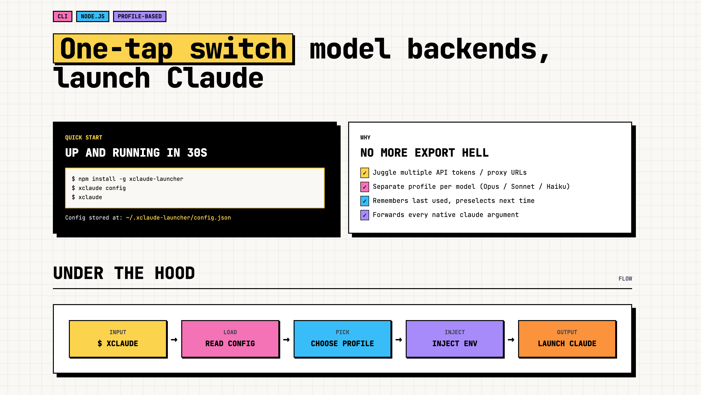

# xClaude Launcher

[English](./README.md) | [中文](./README.zh-CN.md)



`xclaude` solves the problem of switching Claude Code between multiple environment sources.

If you work with more than one Claude setup, such as:

- the default official Claude service
- a proxy or gateway endpoint
- different API base URLs for work and personal use
- different model defaults for different tasks
- different auth tokens across environments

then repeatedly exporting environment variables by hand is tedious and error-prone.

`xclaude` lets you save each setup as a reusable profile, then launch `claude` with the right environment in one step.

## Install

```bash
npm install -g xclaude-launcher
```

## Prerequisites

`xclaude` launches the local `claude` command, so Claude Code must already be installed and available in your `PATH`.

## QuickStart

```bash
# 1. Add your first profile
xclaude config add
```

When creating a profile, you will be prompted for:

**Required**

- `Profile name`: the label shown in the launcher
- `ANTHROPIC_AUTH_TOKEN`: your Claude auth token
- `ANTHROPIC_BASE_URL`: API base URL
- `ANTHROPIC_MODEL`: default model

**Optional**

- `ANTHROPIC_DEFAULT_HAIKU_MODEL`: Haiku override
- `ANTHROPIC_DEFAULT_SONNET_MODEL`: Sonnet override
- `ANTHROPIC_DEFAULT_OPUS_MODEL`: Opus override
- `CLAUDE_CODE_SUBAGENT_MODEL`: subagent model override
- Additional custom ENV vars

Leave optional fields empty if you don't need them.

```bash
# 2. Launch with the interactive picker
xclaude

# 3. Or launch a specific profile directly
xclaude --profile my-profile
```

If you have not created any profiles yet, start with `xclaude config add`.

## Usage

```bash
xclaude                          # interactive picker, then launch claude
xclaude --profile my-profile     # launch a specific profile
xclaude --profile my-profile -- --verbose   # forward args to claude
xclaude --list                   # list profiles and exit (do not launch)
xclaude config                   # open config menu
xclaude config global-env        # manage global ENV
xclaude config path              # print config file path
xclaude apply my-profile         # write profile env into ~/.claude/settings.json
xclaude apply --show             # show managed env currently in settings.json
xclaude apply --clear            # remove managed env from settings.json
xclaude -h                       # full help (also: xclaude config -h, xclaude apply -h)
```

Any unknown args after the launcher flags are forwarded directly to the `claude` process.

## What it does

- `xclaude` opens an interactive profile picker and launches `claude` with the selected profile environment. The picker also offers:
  - `Blank (no profile env)` — launch `claude` without injecting any profile env (global ENV is still applied).
  - `Pure blank (no profile env + no global env)` — launch `claude` with nothing injected.
- `xclaude config` opens the interactive profile manager. The top-level menu provides:
  - `List profiles` — pick a profile and then choose `View` / `Edit` / `Remove`. `View` prints the profile's environment variables one entry per block (key on one line, value on the next) so it stays readable on narrow terminals.
  - `Add profile` — create a new profile.
  - `Edit profile` — pick a profile and edit it directly.
  - `Manage global ENV` — manage environment variables shared by every profile. The submenu provides `View` / `Add` / `Edit` / `Remove`.
  - `Show config path` — print the absolute path of the config file.
- `xclaude apply` writes a profile's managed env into `~/.claude/settings.json` so every `claude` launch (not only those started via `xclaude`) picks them up. See [Apply to settings.json](#apply-to-settingsjson) below.

## Global ENV

Global ENV is a set of environment variables shared by every profile. At launch they are merged in the order `process.env → globalEnv → profile.env`, so a profile-level key always wins over a global one with the same name.

Use it for things that should apply across all profiles — proxies, telemetry switches, sandbox flags, etc. There are no built-in keys or defaults; every entry is one you add yourself.

## Apply to settings.json

`xclaude apply` persists a profile's env into `~/.claude/settings.json` so it
takes effect for **every** `claude` launch on this machine, not only the ones
started through `xclaude`.

```bash
xclaude apply              # pick a profile interactively, then write
xclaude apply my-profile   # write the named profile
xclaude apply --show       # print managed keys currently in settings.json
xclaude apply --clear      # remove managed keys from settings.json
```

Behavior:

- Only these 7 **managed keys** are touched; everything else in `settings.json`
  (hooks, permissions, statusLine, your own custom env keys, etc.) is preserved:
  `ANTHROPIC_AUTH_TOKEN`, `ANTHROPIC_BASE_URL`, `ANTHROPIC_MODEL`,
  `ANTHROPIC_DEFAULT_HAIKU_MODEL`, `ANTHROPIC_DEFAULT_SONNET_MODEL`,
  `ANTHROPIC_DEFAULT_OPUS_MODEL`, `CLAUDE_CODE_SUBAGENT_MODEL`.
- A profile's **custom ENV is NOT written** to `settings.json`. If you need
  custom keys injected at launch time, use the default `xclaude` launcher
  instead — it spawns `claude` with merged env without modifying any file.
- Switching profiles is clean: managed keys present in the previous profile
  but absent from the new one are removed from `settings.json` (no residue).
- Edits are minimal (powered by [`jsonc-parser`](https://www.npmjs.com/package/jsonc-parser)):
  your indentation, comments, and key order in `settings.json` are preserved.
  Writes are atomic (temp file + rename).

`xclaude apply` modifies a persistent file shared by every Claude Code launch,
while the default `xclaude` command only injects env into the child process it
spawns. Pick the one that matches your intent.

## Config file

Profiles are stored in:

```text
~/.xclaude-launcher/config.json
```

The settings file written by `xclaude apply`:

```text
~/.claude/settings.json
```

## Built-in environment variables

`xclaude config` prompts for these first-class variables:

**Required**

- `ANTHROPIC_AUTH_TOKEN`
- `ANTHROPIC_BASE_URL`
- `ANTHROPIC_MODEL`

**Optional**

- `ANTHROPIC_DEFAULT_HAIKU_MODEL`
- `ANTHROPIC_DEFAULT_SONNET_MODEL`
- `ANTHROPIC_DEFAULT_OPUS_MODEL`
- `CLAUDE_CODE_SUBAGENT_MODEL`

You can also add any number of custom environment variables to each profile.
Note: custom env is injected at launch time by the default `xclaude` command,
but is **not** written by `xclaude apply` — only the 7 managed keys above are.

## Development

```bash
npm install
npm run build
npm run start -- --help
```

## Links

- Repository: https://github.com/Jango26/xclaude-launcher
- Issues: https://github.com/Jango26/xclaude-launcher/issues
