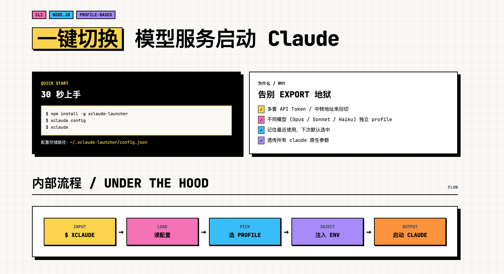

# xClaude Launcher

[English](./README.md) | [中文](./README.zh-CN.md)



`xclaude` 用来解决 Claude Code 在多个环境源之间切换麻烦的问题。

如果你平时会在多个 Claude 配置之间来回切换，比如：

- 官方默认 Claude 服务
- 公司或团队内部代理 / 网关
- 不同的 `ANTHROPIC_BASE_URL`
- 不同环境下使用不同的 token
- 不同场景下使用不同的默认模型

那么每次手动切换环境变量会很繁琐，也很容易出错。

`xclaude` 可以把这些配置保存成可复用的 profile，然后在启动 `claude` 时一键带上对应环境变量。

## 安装

```bash
npm install -g xclaude-launcher
```

## 前置要求

`xclaude` 本身不会替代 Claude Code，它只是负责按指定 profile 启动本地的 `claude` 命令。

所以在使用前，需要先确保：

- 已经安装 Claude Code
- `claude` 命令已经在你的 `PATH` 中可用

## QuickStart

```bash
# 1. 新增第一个 profile
xclaude config add
```

创建 profile 时，会依次提示你填写这些信息：

**必填**

- `Profile name`：这个 profile 在启动器里的显示名称
- `ANTHROPIC_AUTH_TOKEN`：你的 Claude 鉴权 token
- `ANTHROPIC_BASE_URL`：API 地址
- `ANTHROPIC_MODEL`：默认模型

**可选**

- `ANTHROPIC_DEFAULT_HAIKU_MODEL`：Haiku 默认模型覆盖
- `ANTHROPIC_DEFAULT_SONNET_MODEL`：Sonnet 默认模型覆盖
- `ANTHROPIC_DEFAULT_OPUS_MODEL`：Opus 默认模型覆盖
- `CLAUDE_CODE_SUBAGENT_MODEL`：subagent 默认模型覆盖
- 其他自定义 ENV 变量

可选字段不需要的就留空。

```bash
# 2. 使用交互方式选择 profile 并启动
xclaude

# 3. 或者直接指定 profile 启动
xclaude --profile my-profile
```

如果你还没有创建任何 profile，建议先执行：

```bash
xclaude config add
```

## 用法

```bash
xclaude                          # 交互选择 profile 后启动 claude
xclaude --profile my-profile     # 直接以指定 profile 启动
xclaude --profile my-profile -- --verbose   # 透传参数给 claude
xclaude --list                   # 仅列出 profile，不启动
xclaude config                   # 打开配置菜单
xclaude config global-env        # 管理全局 ENV
xclaude config path              # 打印配置文件路径
xclaude apply my-profile         # 把 profile 写入 ~/.claude/settings.json
xclaude apply --show             # 查看 settings.json 里当前的受管 ENV
xclaude apply --clear            # 清掉 settings.json 里的受管 ENV
xclaude -h                       # 完整帮助（也可：xclaude config -h、xclaude apply -h）
```

启动器自己不认识的参数会原样透传给 `claude` 进程。

## 这个工具会做什么

- `xclaude` 会打开一个交互式 profile 选择器，并使用所选 profile 的环境变量启动 `claude`。选择器还提供：
  - `Blank (no profile env)`：不注入任何 profile 环境变量启动 `claude`（全局 ENV 仍然生效）
  - `Pure blank (no profile env + no global env)`：什么环境变量都不注入直接启动 `claude`
- `xclaude config` 会打开交互式 profile 管理界面，顶层菜单包含：
  - `List profiles`：选择一个 profile 后再选 `View` / `Edit` / `Remove`。`View` 会把该 profile 的环境变量逐项打印，每个变量 key 一行、value 在下一行缩进显示，窄终端也不会被折断。
  - `Add profile`：新增一个 profile
  - `Edit profile`：直接选一个 profile 进行编辑
  - `Manage global ENV`：管理所有 profile 共享的全局环境变量，子菜单提供 `View` / `Add` / `Edit` / `Remove`
  - `Show config path`：打印配置文件的绝对路径
- `xclaude apply` 把 profile 的受管 ENV 写入 `~/.claude/settings.json`，让本机上**所有** `claude` 启动（不只 `xclaude` 启动的）都能用上这些变量。详见下方 [写入 settings.json](#写入-settingsjson)。

## 全局 ENV（Global ENV）

全局 ENV 是一组在所有 profile 之间共享的环境变量。启动 `claude` 时的合并顺序为 `process.env → globalEnv → profile.env`，所以同名 key 会以 profile 里的值为准，全局值只会在 profile 没设置时生效。

适合用来放跨 profile 通用的开关，例如代理、telemetry 开关、sandbox 标记等。不会内置任何 key 和默认值，全部由你自己添加。

## 写入 settings.json

`xclaude apply` 会把 profile 的环境变量持久化写入 `~/.claude/settings.json`，
让本机上**所有** `claude` 启动都能用上，而不只是通过 `xclaude` 启动的那些。

```bash
xclaude apply              # 交互选 profile 后写入
xclaude apply my-profile   # 写入指定 profile
xclaude apply --show       # 查看 settings.json 里当前的受管 ENV
xclaude apply --clear      # 清掉 settings.json 里的受管 ENV
```

行为说明：

- 只会动这 7 个**受管 key**，`settings.json` 里其他内容（hooks、permissions、
  statusLine、你自己加的其他 env key 等）都保持不变：
  `ANTHROPIC_AUTH_TOKEN`、`ANTHROPIC_BASE_URL`、`ANTHROPIC_MODEL`、
  `ANTHROPIC_DEFAULT_HAIKU_MODEL`、`ANTHROPIC_DEFAULT_SONNET_MODEL`、
  `ANTHROPIC_DEFAULT_OPUS_MODEL`、`CLAUDE_CODE_SUBAGENT_MODEL`。
- profile 里的**自定义 ENV 不会**写入 `settings.json`。如果需要把自定义 key
  注入到运行时，请用默认的 `xclaude` 启动方式 —— 它通过子进程注入，不会改写
  任何文件。
- 切换 profile 是干净的：上一个 profile 写入但新 profile 里没有的受管 key
  会被从 `settings.json` 里删掉，不留残留。
- 编辑是最小化的（基于 [`jsonc-parser`](https://www.npmjs.com/package/jsonc-parser)）：
  `settings.json` 里的缩进、注释、key 顺序都不会被破坏。写入是原子的
  （写临时文件后 rename）。

`xclaude apply` 修改的是所有 Claude Code 启动都会共享的持久化文件，而默认的
`xclaude` 命令只会向它派生的子进程注入环境变量，请按需选用。

## 配置文件位置

profile 保存在：

```text
~/.xclaude-launcher/config.json
```

`xclaude apply` 写入的文件：

```text
~/.claude/settings.json
```

## 内置支持的环境变量

执行 `xclaude config` 时，会优先提示这些一等字段：

**必填**

- `ANTHROPIC_AUTH_TOKEN`
- `ANTHROPIC_BASE_URL`
- `ANTHROPIC_MODEL`

**可选**

- `ANTHROPIC_DEFAULT_HAIKU_MODEL`
- `ANTHROPIC_DEFAULT_SONNET_MODEL`
- `ANTHROPIC_DEFAULT_OPUS_MODEL`
- `CLAUDE_CODE_SUBAGENT_MODEL`

除此之外，你也可以为每个 profile 添加任意数量的自定义环境变量。
注意：自定义 ENV 会被默认 `xclaude` 启动时注入到子进程，但**不会**被
`xclaude apply` 写入 `settings.json` —— 后者只动上面这 7 个受管 key。

## 开发

```bash
npm install
npm run build
npm run start -- --help
```

## 链接

- Repository: https://github.com/Jango26/xclaude-launcher
- Issues: https://github.com/Jango26/xclaude-launcher/issues
